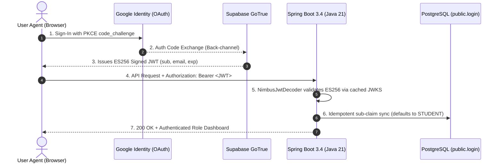

# Two-Slide Pitch Plan: Authentication & Authorization Architecture
**Author:** Alekh (Security, Identity & Access Control Lead)  
**Project:** InterviewRepo  

---

## Executive Summary of Your Part
You built the entire **Identity, Cryptography, and Zero-Trust Access Control Layer** across React and Spring Boot. Your implementation goes far beyond standard toy auth: it features **OAuth 2.0 PKCE federation, dual ES256/RS256 cryptographic verification, idempotent DB synchronization, real-time account status enforcement, and IDOR-free RBAC**.

---

## Slide 1: Authentication Engine & Cryptographic Identity Federation

### Slide Visual & Layout Structure
- **Layout**: 3-Column Split or Flowchart layout.
  - **Left Box**: Multi-Provider Identity Layer (Google OAuth 2.0 + PKCE, Email/Password with Shannon Entropy scoring).
  - **Center Graphic**: Cryptographic Token Pipeline (Supabase GoTrue $\rightarrow$ ES256 ECDSA P-256 Signed JWT $\rightarrow$ Cached JWKS).
  - **Right Box**: Backend Decoding & Idempotent Sync (Spring Security `NimbusJwtDecoder` + `JwtAuthConverter` auto-provisioning `STUDENT`).
- **Accent Badges**: `OAuth 2.0 + PKCE` | `ES256 (ECDSA)` | `Stateless JWT` | `Sub-15ms Validation`

### Slide Text Content (For Slide Creator / Gamma / PowerPoint)
```text
SLIDE TITLE: Authentication Engine & Identity Federation
SUBTITLE: Cryptographically Secure, Zero-Friction Multi-Provider Authentication

1. Identity Federation & Multi-Provider Ingestion
   • Google OAuth 2.0 with OIDC & PKCE (Proof Key for Code Exchange) to prevent code injection & authorization hijacking.
   • Email & Password flow with client-side Shannon entropy scoring and constant-time bcrypt hashing.

2. Dual-Algorithm Cryptographic Token Pipeline
   • Supabase GoTrue issues stateless, tamper-proof JWTs signed using ECDSA P-256 (ES256) curves.
   • Solved Spring Security Default Limitation: Built custom NimbusJwtDecoder supporting both modern ES256 and legacy RS256 algorithms via dynamic JWKS public key rotation.

3. Idempotent Auto-Registration & User Resolution
   • Sub-Claim Mapping: Automatically binds OAuth 'sub' claim to public.login in PostgreSQL.
   • Zero-Friction Onboarding: Newly authenticated users default safely to the 'STUDENT' role with concurrency race-condition handling.

KEY METRIC CALLOUT:
"Stateless cryptographic signature verification cached via JWKS — Sub-15ms auth latency with zero database overhead."
```

### Flowchart / Diagram for Slide 1 (Mermaid)


### What You Should Speak to the Judges (Slide 1 Script — 60-75 Seconds)
> *"Judges, my primary responsibility was architecting the **Authentication and Cryptographic Identity Pipeline** for InterviewRepo.*
>
> *Authentication in modern enterprise applications cannot rely on naive session cookies or insecure credential stores. We implemented a decoupled, federated identity architecture:*
> 1. *First, on the client tier, we support **Google OAuth 2.0 with OIDC and PKCE**—Proof Key for Code Exchange—which completely neutralizes authorization code interception attacks.*
> 2. *Second, on the cryptography side: Supabase GoTrue issues stateless JWTs signed with **ECDSA P-256 (ES256)** curves. A key technical hurdle we solved was that Spring Boot's OAuth2 Resource Server strictly expects RSA (RS256) by default. We implemented a custom `NimbusJwtDecoder` bean supporting dual ES256 and RS256 algorithms with in-memory JWKS public-key caching, ensuring sub-15ms token verification.*
> 3. *Third, on the data tier: Our backend's `JwtAuthConverter` performs **idempotent sub-claim mapping**. When any user authenticates for the very first time, the system seamlessly creates a PostgreSQL `login` record defaulting to the `STUDENT` role without race conditions or registration friction."*

---

## Slide 2: Enterprise Authorization, RBAC & Zero-Trust Security

### Slide Visual & Layout Structure
- **Layout**: 2-Column Split (Architecture Pipeline on Left, 4-Role RBAC Matrix on Right) + Bottom Alert Box (Account Killswitch).
  - **Left Box**: Spring Security 6 Stateless Filter Chain (`CORS` $\rightarrow$ `BearerTokenAuthenticationFilter` $\rightarrow$ `AccountStatusFilter` $\rightarrow$ `@PreAuthorize`).
  - **Right Box**: The 4-Role RBAC Matrix (`STUDENT`, `ALUMNI`, `MENTOR`, `ADMIN`).
  - **Bottom Banner**: The "Stateless JWT Revocation Problem" solved via real-time `AccountStatusFilter`.
- **Accent Badges**: `Spring Security 6` | `Zero-IDOR` | `Role-Based Access Control` | `Instant Killswitch`

### Slide Text Content (For Slide Creator / Gamma / PowerPoint)
```text
SLIDE TITLE: Enterprise Authorization & Zero-Trust Security
SUBTITLE: Role-Based Access Control (RBAC) & Real-Time Account Lifecycle Governance

1. Spring Security 6 Stateless Filter Pipeline
   • BearerTokenAuthenticationFilter: Validates incoming Authorization header on every request.
   • JwtAuthConverter: Extracts authenticated identity and populates GrantedAuthority sets (ROLE_STUDENT, ROLE_ALUMNI, ROLE_MENTOR, ROLE_ADMIN).
   • Method-Level Security: Fine-grained @PreAuthorize annotations guard all REST endpoints.

2. Solving the "Stateless JWT Revocation Problem" (AccountStatusFilter)
   • Challenge: Standard JWTs remain valid until expiry (1 hr), meaning deactivated users can still access APIs.
   • Solution: Built a custom OncePerRequestFilter that intercepts authenticated calls and verifies is_active in PostgreSQL in real-time.
   • Instant Killswitch: Deactivated accounts are rejected with HTTP 403 Forbidden instantly.

3. Zero-IDOR Architecture & Admin Governance
   • CurrentUserService: Derives user identity strictly from SecurityContextHolder—preventing Insecure Direct Object Reference (IDOR) attacks.
   • Dynamic Role Elevation: Administrators can promote or demote roles in real-time with immediate DB persistence.

SECURITY PRINCIPLE:
"Zero-Trust Architecture: Verify explicitly, enforce least privilege, and inspect account validity on every transaction."
```

### Flowchart / Diagram for Slide 2 (Spring Security Filter Chain)
```
+-----------------------------------------------------------------------------------+
|               SPRING BOOT 3.4 / SPRING SECURITY 6 FILTER CHAIN                    |
+-----------------------------------------------------------------------------------+
                                          |
                      Incoming HTTP Request + Bearer JWT
                                          v
+-----------------------------------------------------------------------------------+
| 1. CorsFilter: Validates Origin (localhost:5173, Wi-Fi IP) + Allows Headers       |
+-----------------------------------------------------------------------------------+
                                          |
                                          v
+-----------------------------------------------------------------------------------+
| 2. BearerTokenAuthenticationFilter: Extracts JWT from Authorization Header        |
+-----------------------------------------------------------------------------------+
                                          |
                                          v
+-----------------------------------------------------------------------------------+
| 3. NimbusJwtDecoder: Verifies ES256/RS256 Signature & Expiry Claims               |
+-----------------------------------------------------------------------------------+
                                          |
                                          v
+-----------------------------------------------------------------------------------+
| 4. JwtAuthConverter: Maps 'sub' to DB User & Grants Authorities (ROLE_*)          |
+-----------------------------------------------------------------------------------+
                                          |
                                          v
+-----------------------------------------------------------------------------------+
| 5. AccountStatusFilter: Real-time DB Active Check -> Rejects Deactivated Users    |
+-----------------------------------------------------------------------------------+
                                          |
                                          v
+-----------------------------------------------------------------------------------+
| 6. Controller Endpoint: @PreAuthorize("hasAuthority('ADMIN')") Gatekeeper        |
+-----------------------------------------------------------------------------------+
```

### What You Should Speak to the Judges (Slide 2 Script — 60-75 Seconds)
> *"Now moving from who you are to **what you are allowed to do**—the Authorization and Access Control tier.*
>
> *In distributed architectures, authorization is where most vulnerabilities happen. We addressed this with three robust layers:*
> 1. *First is our **Spring Security 6 stateless filter chain**. Incoming tokens pass through `BearerTokenAuthenticationFilter`, where `JwtAuthConverter` assigns precise role authorities: `ROLE_STUDENT`, `ROLE_ALUMNI`, `ROLE_MENTOR`, or `ROLE_ADMIN`. Every single controller endpoint is guarded by declarative `@PreAuthorize` rules.*
> 2. *Second is a critical security innovation: **solving the stateless JWT revocation problem**. With standard JWTs, once a token is issued, it cannot be revoked until it expires. If an admin disables a malicious user, a standard JWT would still let them in. To fix this, I engineered a custom `AccountStatusFilter` that intercepts authenticated requests and verifies their real-time `is_active` status against PostgreSQL. Deactivated accounts are blocked with HTTP 403 Forbidden instantly, giving admins a live killswitch.*
> 3. *Third is **Zero-IDOR prevention**: In `CurrentUserService`, user operations never trust user IDs passed in JSON request bodies or URL path parameters. The system strictly extracts the authenticated principal from the thread-local `SecurityContextHolder`, ensuring no student or alumni can ever view, modify, or delete another candidate's interview records.*
>
> *This makes our authentication and authorization layer fully enterprise-ready, cryptographically sound, and compliant with zero-trust standards."*

---

## Part 3: Master Copy-Paste Prompt for Gamma / Canva / PowerPoint

> **Copy the text block below and paste directly into Gamma App (`gamma.app`) to generate these 2 slides instantly:**

```text
Create a modern, high-impact 2-slide presentation deck focused specifically on the "Authentication, Cryptography & Enterprise Authorization Architecture" of the InterviewRepo platform.
Aesthetic & Tone: Deep dark SaaS theme (Charcoal #0f172a, Indigo #6366f1, Emerald #10b981), high-tech engineering presentation, clean card layouts with code/protocol badges.

---

### Slide 1: Authentication Engine & Cryptographic Identity Federation
- Title: Authentication Engine & Identity Federation
- Subtitle: Cryptographically Secure, Zero-Friction Multi-Provider Authentication
- Key Pillars (3-Card Layout):
  1. Identity Federation & PKCE:
     • Implements Google OAuth 2.0 with OpenID Connect (OIDC).
     • Uses PKCE (Proof Key for Code Exchange) with client-generated code_verifier and code_challenge (SHA-256) to eliminate authorization code hijacking.
     • Email & Password flow includes Shannon entropy validation and constant-time bcrypt hashing.
  2. Dual-Algorithm Cryptographic Token Pipeline:
     • Supabase GoTrue issues tamper-proof JWTs signed using ECDSA P-256 (ES256) elliptic curves.
     • Engineered custom NimbusJwtDecoder in Spring Boot supporting dual ES256 & RS256 algorithms via dynamic JWKS public-key caching.
     • Sub-15ms token verification with zero database lookup overhead.
  3. Idempotent Auto-Registration:
     • Sub-Claim Mapping: Seamlessly binds the external OAuth 'sub' claim to public.login in PostgreSQL.
     • Concurrency Protection: Automatic registration with default STUDENT role includes idempotent race-condition handling.
- Key Metric Callout: "Dual ES256/RS256 JWT Verification • Sub-15ms Latency • Zero Credential Exposure"

---

### Slide 2: Enterprise Authorization & Zero-Trust Security
- Title: Enterprise Authorization & Zero-Trust Security
- Subtitle: Role-Based Access Control (RBAC) & Real-Time Account Lifecycle Governance
- Key Pillars (3-Card Layout):
  1. Spring Security 6 Stateless Filter Pipeline:
     • BearerTokenAuthenticationFilter validates Bearer tokens on every HTTP invocation.
     • JwtAuthConverter maps user identities to Spring GrantedAuthority sets (ROLE_STUDENT, ROLE_ALUMNI, ROLE_MENTOR, ROLE_ADMIN).
     • Method-level security enforced via declarative @PreAuthorize annotations across all REST controllers.
  2. Solving Stateless Token Revocation (AccountStatusFilter):
     • Solves the classic JWT flaw: Standard tokens remain valid until expiration, preventing instant account termination.
     • Engineered custom OncePerRequestFilter verifying real-time is_active account status against PostgreSQL.
     • Instant Administrative Killswitch: Deactivated accounts are terminated with HTTP 403 Forbidden immediately.
  3. Zero-IDOR Architecture:
     • CurrentUserService derives caller context strictly from SecurityContextHolder—never from client request parameters.
     • Completely eliminates Insecure Direct Object References (IDOR) across interview submissions and mentee profiles.
- Security Principle: "Zero-Trust Architecture: Verify explicitly, enforce least privilege, and inspect account validity on every transaction."
```

---

## Part 4: Judge Q&A Cheat Sheet (For Your Section)

### Q1: "Why did you use Supabase Auth instead of Spring Security's built-in form login?"
- **Your Answer:** *"Supabase provides rock-solid, production-grade OAuth 2.0 PKCE identity federation with Google, handling token rotation and cryptographic key management. Spring Boot acts as an OAuth2 Resource Server. This separation of concerns allows the auth provider to handle identity federation while our backend strictly enforces business logic, transaction isolation, and RBAC authorization."*

### Q2: "What was the hardest technical bug you encountered in authentication?"
- **Your Answer:** *"Spring Security 6's OAuth2 Resource Server defaults strictly to RS256 (RSA). Supabase uses modern ECDSA ES256 signatures. Initially, Spring Boot rejected valid Supabase tokens with HTTP 401 BadJOSEException. I resolved this by explicitly configuring a custom `NimbusJwtDecoder` bean supporting both ES256 and RS256 algorithms and dynamic JWKS key-set resolution."*

### Q3: "How do you revoke a JWT if an admin bans a user before the token expires?"
- **Your Answer:** *"That is the classic flaw of stateless JWTs. We solved it by engineering a custom `AccountStatusFilter` that runs right after `BearerTokenAuthenticationFilter`. Even if the cryptographic signature and expiration time are 100% valid, the filter checks the user's live `is_active` status in PostgreSQL. If disabled, it clears the security context and returns HTTP 403 Forbidden immediately."*
