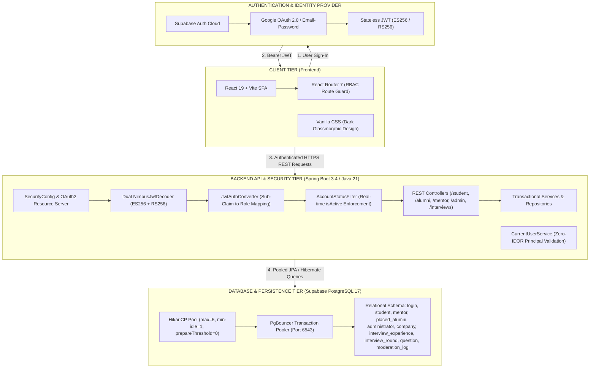

# Presentation Guide: Free AI PPT Tools & Master Prompt (with System Architecture & Project Specifications)

This document provides:
1. **Top Free Tools** to generate a pitch deck for free (Gamma, Canva, SlidesAI, Marp).
2. **Complete Project Overview & Technical Specifications** (ready for judges).
3. **System Architecture Diagrams** (Mermaid.js code + ASCII block diagram for slide tools).
4. **The Master Copy-Paste AI Prompt** pre-structured with 13 comprehensive slides including architecture diagrams, data flows, and project details.

---

## Part 1: Where to Make Your Presentation for Free

| Tool | Website | Free Tier Features | Best For |
| :--- | :--- | :--- | :--- |
| **Gamma App** *(#1 Recommended)* | [gamma.app](https://gamma.app) | • 400 free AI credits on sign up<br>• Accepts markdown outline directly<br>• Exports directly to `.pptx` & `.pdf`<br>• Natively renders Mermaid architecture diagrams & code blocks<br>• Gorgeous modern SaaS dark/light themes | The cleanest, most professional tech decks with zero design effort. |
| **Canva Magic Design** | [canva.com](https://canva.com) | • Free tier with "Magic Design for Presentations"<br>• Choose from hundreds of modern startup templates<br>• Full manual editing & drag-and-drop | Customizing visual assets, logos, and animations. |
| **SlidesAI.io** | [slidesai.io](https://slidesai.io) | • Free Google Slides add-on (3 decks/mo)<br>• Generates slides directly inside your Google Drive | If your judges or college require a Google Slides link. |
| **Tome** | [tome.app](https://tome.app) | • Free AI starter credits<br>• Minimalist modern layouts with dark mode | Fast AI storytelling decks. |
| **Marp (VS Code)** | [marp.app](https://marp.app) | • 100% Free & Open Source (No limits)<br>• Converts Markdown files directly into `.pptx` or `.pdf` | Offline developer workflow directly in VS Code. |

---

## Part 2: Quick Start Instructions (Using Gamma App — 2 Minutes)

1. Go to **[gamma.app](https://gamma.app)** and sign in with Google (Free).
2. Click **"Create new with AI"** $\rightarrow$ select **"Text to Deck"** or **"Paste in text"**.
3. Select **Presentation** format (12 or 13 cards/slides).
4. **Copy the Master Prompt below** (from Part 4) and paste it into the prompt box.
5. Choose a theme:
   - Recommended themes: **"Midnight"**, **"Charcoal"**, **"Obsidian"**, or **"Electric"** (dark SaaS themes that match `uxpilot.ai` aesthetics).
6. Click **Generate**!
7. Once generated, click the **Share / Export** button at top-right $\rightarrow$ **"Export to PowerPoint (.pptx)"** or **"Export to PDF"**.

---

## Part 3: Architecture Diagrams for Manual / Visual Slide Insertion

If you are inserting diagrams manually into PowerPoint, Canva, or Gamma, use these diagrams:

### 1. High-Level 3-Tier Architecture Diagram (Mermaid)



### 2. Layered ASCII Component Architecture Diagram (for Slide Text Boxes)

```
+-----------------------------------------------------------------------------------+
|                            CLIENT TIER: React 19 + Vite                           |
|  - Student Hub  |  Alumni Portal  |  Mentor Workspace  |  Admin Governance Console  |
|  - Reactive Search & Filter Engine  |  Experience Stepper  |  Candidate Inspection |
+------------------------------------------+----------------------------------------+
                                           | Authorization: Bearer <Supabase JWT>
                                           v
+-----------------------------------------------------------------------------------+
|               API & SECURITY GATEWAY: Spring Boot 3.4.1 (Java 21 LTS)             |
|  - Spring Security 6 (Stateless OAuth2 Resource Server)                           |
|  - Dual Signature Decoder: ES256 (ECDSA P-256) + RS256 (RSA 2048)                  |
|  - JwtAuthConverter: Idempotent Sub-Claim to DB User Resolution (Default: STUDENT)|
|  - AccountStatusFilter: Real-time Account Active/Deactivated Guard                 |
|  - CurrentUserService: Authenticated Principal Context (Zero IDOR)                 |
+------------------------------------------+----------------------------------------+
                                           | Spring Data JPA / Hibernate 7
                                           v
+-----------------------------------------------------------------------------------+
|                     DATA ACCESS LAYER: HikariCP Connection Pool                   |
|  - maximum-pool-size: 5  |  minimum-idle: 1  |  prepareThreshold=0                |
+------------------------------------------+----------------------------------------+
                                           | Port 6543 (Transaction Mode)
                                           v
+-----------------------------------------------------------------------------------+
|                PERSISTENCE TIER: PostgreSQL 17 (Supabase Cloud + PgBouncer)       |
|  - Core Auth: public.login (id, email, role, auth_user_id, is_active)             |
|  - Role Entities: student, mentor, placed_alumni, administrator                   |
|  - Interview Graph: company -> interview_experience -> interview_round -> question|
|  - Governance: moderation_log (admin_id, entity_id, action, timestamp)           |
+-----------------------------------------------------------------------------------+
```

---

## Part 4: Master Copy-Paste AI Presentation Prompt (with Architecture & General Details)

> **Copy everything inside the block below and paste directly into Gamma, ChatGPT, Claude, Canva, or Tome:**

```text
Create a modern, comprehensive 13-slide pitch presentation for an enterprise software engineering hackathon project named "InterviewRepo". 
Theme & Tone: Professional, high-tech, modern SaaS, enterprise software engineering (Deep indigo #4f46e5, slate #0f172a, and glassmorphic card design).
Include full project general details, technical stack specifications, visual architecture diagrams, database models, user workflows, and live demo steps.

---

### Slide 1: Title & Hero
- Title: InterviewRepo
- Subtitle: Enterprise-Grade Interview Intelligence & Mentorship Platform
- Tagline: Eliminating information asymmetry in campus placements through verified interview journeys and structured 1-on-1 mentorship.
- General Project Details:
  • Category: Higher Education EdTech / Institutional Placement Intelligence SaaS
  • Target Users: Engineering Students, Placed Alumni, Industry Mentors, Placement Coordinators
  • Tech Stack: Java 21 LTS, Spring Boot 3.4, React 19, Supabase Auth (ES256/RS256), PostgreSQL 17
- Visual: Sleek dark SaaS hero card showcasing the 4 distinct user roles: Student, Alumni, Mentor, Admin.

---

### Slide 2: The Campus Placement Crisis (Problem Statement)
- Header: The Problem: Campus Placements Suffer from Broken Information Flow
- 4 Key Problem Dimensions (Use a 4-card grid):
  1. Fragmented & Unstructured Data: Students rely on scattered WhatsApp messages and LeetCode forums with zero round-by-round breakdown.
  2. The Alumni Disconnect: Graduating seniors take their valuable interview insights into the corporate world, leaving junior batches with zero institutional memory.
  3. No Verification or Quality Control: Public forums (Glassdoor, Reddit) suffer from fake submissions, unmoderated claims, and noisy spam.
  4. Spreadsheets & Ad-Hoc Mentorship: College placement cells struggle with manual coordination, unable to pair struggling students with domain-matched mentors.
- Statistic Callout: "Over 85% of engineering candidates state that lack of company-specific, round-by-round technical insights is their #1 interview hurdle."

---

### Slide 3: The Solution — InterviewRepo Platform Overview
- Header: The Solution: A Verified Single Source of Truth
- Subtitle: Transforming hearsay into structured, actionable interview intelligence.
- Core Value Pillars (3-column layout):
  1. Relational Multi-Round Intelligence: Structured breakdown of real company interviews—rounds, exact algorithmic/system design questions, difficulty, and tips.
  2. Institutional Quality Moderation: Human-in-the-loop administrative moderation queue with immutable audit logging before publication.
  3. Closed-Loop Mentorship Ecosystem: Automated mentee assignment and deep candidate profile inspection for industry mentors.
- Core Metric: "100% preservation of institutional placement knowledge across batches."

---

### Slide 4: General Project Specifications & Technology Stack
- Header: Project Specifications & Engineering Stack
- Specifications Grid (Use a 2-column or 4-box layout):
  • Frontend Layer:
    - Framework: React 19 + Vite SPA (Fast HMR, ES Modules)
    - Routing: React Router 7 with role-based route guards
    - Styling: Pure Vanilla CSS with tailored design tokens, dark glassmorphism, responsive mobile-first grids
    - Icons: Lucide React suite
  • Backend Layer:
    - Runtime: Java 21 LTS
    - Framework: Spring Boot 3.4+ / Spring Framework 6
    - Architecture: Stateless RESTful API, Service Layer Pattern, Spring Data JPA / Hibernate 7
    - Build Tool: Apache Maven with automated multi-profile compilation
  • Identity & Security Tier:
    - Provider: Supabase Cloud Auth (Google OAuth 2.0 & Email/Password)
    - Protocol: OAuth2 Resource Server with dual ES256 (ECDSA) and RS256 (RSA) JWT validation
    - Security Model: Role-Based Access Control (RBAC), zero-IDOR ownership checks
  • Database & Persistence Tier:
    - Database: PostgreSQL 17 Cloud on Supabase
    - Connection Management: PgBouncer Transaction Pooler (Port 6543) with HikariCP pool tuning
    - Pool Settings: maximum-pool-size: 5, minimum-idle: 1, prepareThreshold: 0

---

### Slide 5: System Architecture Diagram (Core Technical Deep Dive)
- Header: System Architecture: End-to-End Enterprise Topology
- Subtitle: Fully decoupled client, stateless security gateway, and pooled transactional database.
- Visual Layout (Render as a 3-tier layered flowchart):
  • Tier 1: Client Application (React 19 + Vite)
    - Handles UI rendering, reactive search/filtering, and Bearer JWT token injection.
  • Tier 2: Security & REST API Gateway (Spring Boot 3.4 / Java 21)
    - SecurityConfig: Stateless Bearer token filter chain.
    - NimbusJwtDecoder: Decodes Supabase ES256 & RS256 tokens using cloud JWKS.
    - JwtAuthConverter: Idempotent user resolution; auto-assigns STUDENT role on first login.
    - AccountStatusFilter: Real-time active status verification against DB.
    - Controllers: Protected REST endpoints guarded by @PreAuthorize role annotations.
  • Tier 3: Persistence & Database (PostgreSQL 17 + PgBouncer)
    - HikariCP pool manages connections to PgBouncer port 6543.
    - Relational schema enforcing referential integrity and cascade persistence.

---

### Slide 6: Database Entity-Relationship (ER) & Data Flow
- Header: Relational Data Model: Engineered for Precision
- Subtitle: Normalized PostgreSQL schema linking user identities, profiles, and interview rounds.
- Key Entity Relationships (Display as structured schema blocks):
  1. Root Identity: `public.login` (id, email, role, auth_user_id, name, is_active)
     - Maps 1:1 to role profile tables: `student`, `mentor`, `placed_alumni`, `administrator`.
  2. Mentorship Mapping: `student.mentor_id` -> `mentor.id` (1:N relationship)
     - Allows centralized admin assignment and mentor mentee inspection.
  3. Interview Hierarchy (Cascade Linked):
     - `company` (id, name, industry, website)
     - `interview_experience` (id, company_id, role, difficulty, result, preparation, tips, moderation_status)
     - `interview_round` (id, interview_id, round_order, name, notes)
     - `question` (id, round_id, question_text, topic, difficulty)
  4. Governance Audit Trail:
     - `moderation_log` (id, admin_id, entity_type, entity_id, action, reason, timestamp)

---

### Slide 7: The 4-Role Architecture & User Journey
- Header: 4 Dedicated Workspaces, One Cohesive Ecosystem
- Display as 4 Cards / Quadrants:
  • Student Workspace (`/student`):
    - Default landing page for all new accounts.
    - Explore verified experiences, practice questions, view assigned mentor, and manage profile.
  • Placed Alumni Portal (`/alumni`):
    - Browse community experiences while managing their own interview submission history.
    - Submit multi-round interview experiences anytime via interactive stepper.
  • Mentor Hub (`/mentor`):
    - Inspect assigned mentee roster, view candidate academic profiles and skills, and review submissions.
  • Admin Governance Console (`/admin`):
    - Manage user directory, promote/demote roles, assign student-mentor pairings, and moderate queue.

---

### Slide 8: Deep Dive: Student Preparation Hub
- Header: Student Workspace: Search, Filter, & Master Real Loops
- Highlights (3-card grid):
  • Multi-Filter Feed: Instant live search across companies, roles, and DSA topics. Filter pills for Difficulty (Easy, Medium, Hard) and Outcome (Offered, Rejected).
  • Deep Round Breakdown: Detail inspection modal displaying hiring timelines (OA -> Onsite loops), preparation books, and candidate tips.
  • Real Question Bank: Round-by-round technical questions showing Big-O complexity requirements and system design trade-offs.
  • Assigned Mentor Visibility: Direct access to assigned mentor's bio, domain expertise, and mailto contact channels.
- Visual: Search bar with filter pills and expandable card layout with company monogram logos.

---

### Slide 9: Deep Dive: Alumni Portal & Experience Engine
- Header: Placed Alumni: Giving Back with High-Fidelity Data
- Highlights:
  • Dynamic Multi-Round Builder: Intuitive modal stepper to log rounds, question ordering, and difficulty tags.
  • Preparation Roadmaps: Captures preparation books, coding sheets (Blind 75/Striver), and hiring timelines.
  • Full CRUD Control: Edit, update, or remove past submissions with instant database synchronization.
  • Dual Capability: Alumni can browse community experiences while submitting their own journeys anytime.
- Visual: Multi-step submission form mockup with "+ Add Round" and "+ Add Question" buttons.

---

### Slide 10: Deep Dive: Mentor Hub & Admin Governance
- Header: Mentorship & Administration: Closed-Loop Governance
- 2-Column Comparative Layout:
  • Column A: Mentor Workspace
    - Mentee Roster: Displays assigned students with degree, batch, and skills tags.
    - Candidate Inspection Drawer: Deep view into student resume URL, GitHub, LinkedIn, and past interview attempts.
    - Available Students Pool: Browse unassigned candidates and claim mentees based on mentor bandwidth.
  • Column B: Admin Console
    - User Directory: Live table with instant role switcher (Student, Alumni, Mentor, Admin).
    - 1-on-1 Mentorship Assignment: Dropdown to pair any student with an active industry mentor in real-time.
    - Moderation Pipeline: Approve or reject pending submissions with custom feedback before public release.
    - Audit Trail: Immutable logging in moderation_log capturing every administrative decision.

---

### Slide 11: Under the Hood: Key Engineering Challenges Solved
- Header: Engineering Rigor: Real Technical Obstacles Solved
- 3 Key Engineering Highlights:
  1. Dual ES256 & RS256 JWT Decoding:
     - Challenge: Spring Security defaults strictly to RS256, rejecting Supabase's ECDSA ES256 OAuth tokens with HTTP 401.
     - Solution: Configured custom NimbusJwtDecoder supporting both ES256 and RS256 algorithms.
  2. Transaction Pooler Connection Scaling:
     - Challenge: Supabase session mode (port 5432) enforces a strict 15-client limit (EMAXCONNSESSION).
     - Solution: Routed JDBC via PgBouncer transaction pooler (port 6543) with prepareThreshold=0 and tuned HikariCP (max-pool: 5).
  3. Idempotent Auto-Registration:
     - Challenge: Concurrent requests on first login caused unique constraint race conditions on auth_user_id.
     - Solution: Implemented idempotent fallback transaction handling in JwtAuthConverter.

---

### Slide 12: Seeded Dataset & Live Production Verification
- Header: Production-Ready Verification & Seeded Dataset
- Metrics & Seeded Data (Use clean metric callouts):
  • 6 Premier Tech Companies Seeded: Google, Amazon, Microsoft, Atlassian, Uber, Goldman Sachs.
  • 12 Detailed Technical Rounds: Covering Graph Algorithms, Operating Systems, Concurrency, and System Design.
  • 12 Real Technical Questions: With exact problem statements, difficulty badges, and preparation tips.
  • 100% Test & Build Integrity:
    - Frontend build: Vite build succeeded in 431ms with 0 errors.
    - Backend build: Maven compiled all 82 source files with 0 errors.
    - Health Check: GET /health returns 200 OK {"service":"interviewrepo-security","status":"UP"}.

---

### Slide 13: Impact, Future Roadmap & Conclusion
- Header: Impact, Roadmap & The Future of Interview Intelligence
- Measurable Outcomes:
  • 80% reduction in candidate time spent searching for reliable company interview patterns.
  • 100% institutional knowledge retention across graduating batches.
  • Zero manual spreadsheet coordination for placement coordinators.
- Future Roadmap:
  • Phase 1: Real-time WebRTC Mock Interview Video Rooms.
  • Phase 2: AI Mock Interview Assistant generating company-specific question loops.
  • Phase 3: Placement Cell Predictive Analytics Dashboard.
- Closing Tagline: "InterviewRepo: Transforming campus placement hearsay into verified, institutional intelligence."
```

---

## Part 5: Presenter Delivery Guide for Judges

1. **Lead with the General Details (Slide 1 & 4)**: Mention right away that this is built with **Java 21, Spring Boot 3.4, React 19, Supabase Auth, and PostgreSQL 17**. Judges respect enterprise-grade stacks over toy wrappers.
2. **Spend 90 Seconds on the Architecture (Slide 5 & 6)**: Point to the 3-tier architecture diagram. Explain how the frontend uses stateless Bearer JWTs, how Spring Boot decodes ES256 tokens, and how PgBouncer transaction pooling prevents connection pool exhaustion.
3. **Highlight the Database Schema (Slide 6)**: Emphasize that experiences are relationally modeled (`Experience -> Rounds -> Questions`) rather than stored as raw, unstructured text.
4. **Transition to Live Demo**: After Slide 12, switch tabs to `http://localhost:5173` and walk through the 4 live dashboards!
